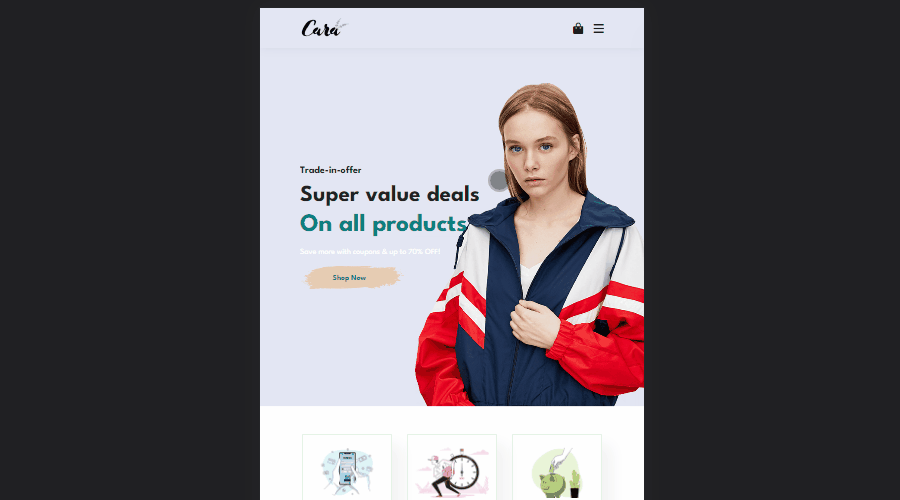

# Ecommerce-FullResponsive
Desenvolvimento da estrutura visual de um site disponibilizado na internet.

  
  
  
  

  
  
  
  

## Descrição
Este foi um Ecommerce full responsivo simples desenvolvido para fins de aprendizado utilizando apenas HTMl, CSS e Javascript puro. Utilizando um template simples e elegante.

  
  

##  🚀 **Tecnologias**
**Este projeto foi desenvolvido com as seguintes tecnologias:**
 - HTML 
 - CSS 
 - JAVASCRIPT

##   📝AUTOR
[@SilvioLeo](https://github.com/SilvioLeo)
